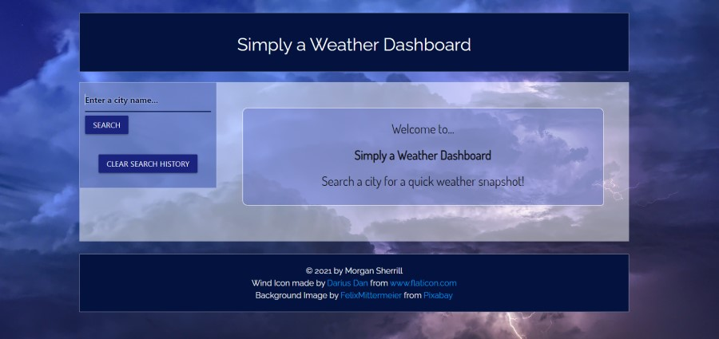
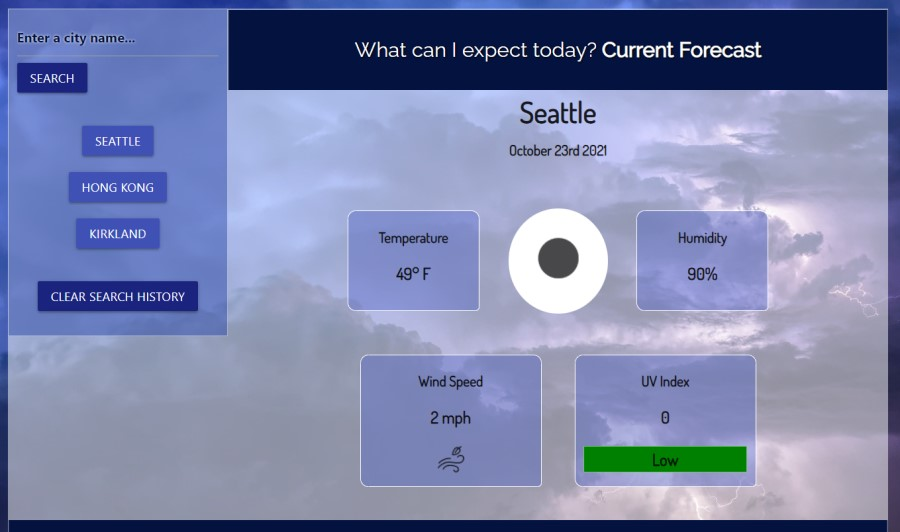
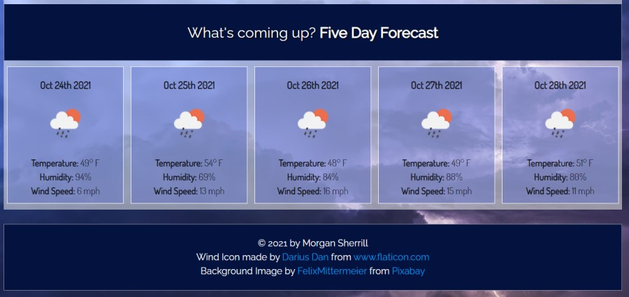

# Weather Dashboard

Week 6 Homework

## Description

This is a weather dashboard where the user can search for a city and be provided with a report of weather data. They will receive the forecast for the current weather conditions and a 5-day forecast representing future weather conditions. Their searched city will be added to their search history list. If the user needs to toggle back to a previously searched city, they can click the city from their search history to re-display that data. To clear our their search history, the "clear search history" button can be clicked. 

Current Weather Conditions:
- City Name
- Current Date
- Icon Representation of Weather Conditions
- Current Temperature
- Current Humidity
- Current Wind Speed
- Current UV Index
    - When viewing the UV Index, there is a color indicator to signal low to extreme. This follows the UV Index color indicators of:
        - Green (low)
        - Yellow (moderate)
        - orange (high)
        - Red (very high)
        - Violet (extreme)

5-Day Forecast:
- Display of the Date
- Icon Representation of Weather Conditions
- Temperature
- Humidity
- Wind Speed

## Languages
- HTML
- CSS
- JS

#### With Help From
- Jquery
- Materialize
- OpenWeatherApp

## Link to GitHub main project page

[Project Page on GitHub](https://github.com/m-sherrill/weather-app)

## Link to Deployed Application

[Live Deployed Link](https://m-sherrill.github.io/weather-app/)

## Screenshots of Finished Product

Landing Page:

Search Field, Search History, and Current Weather Deployed:

5-Day Forecast:

## Contact Information

Github: [@m-sherrill](https://github.com/m-sherrill)

Email: mo.sherrill@outlook.com
